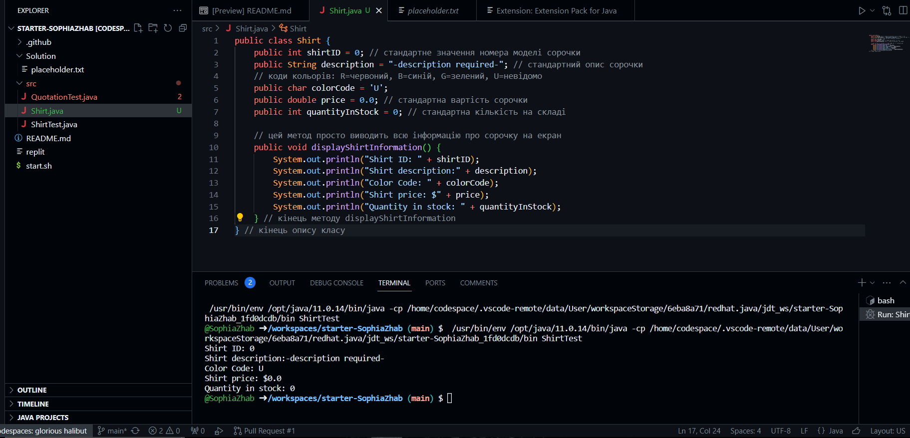
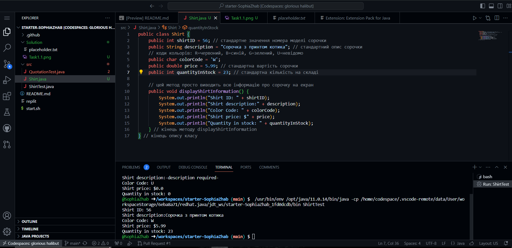
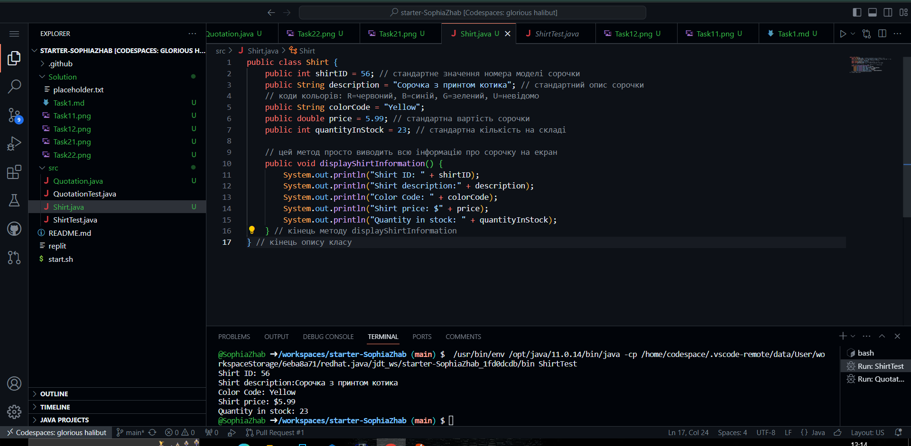

Завдання 1. Створення та запуск першої програми (сорочки)
Запуск початкового коду

Відредагування даних про сорочку

```java
public class Shirt {
    public int shirtID = 56; // стандартне значення номера моделі сорочки
    public String description = "Сорочка з принтом котика"; // стандартний опис сорочки
    // коди кольорів: R=червоний, B=синій, G=зелений, U=невідомо
    public char colorCode = 'W';
    public double price = 5.99; // стандартна вартість сорочки
    public int quantityInStock = 23; // стандартна кількість на складі

    // цей метод просто виводить всю інформацію про сорочку на екран
    public void displayShirtInformation() {
        System.out.println("Shirt ID: " + shirtID);
        System.out.println("Shirt description:" + description);
        System.out.println("Color Code: " + colorCode);
        System.out.println("Shirt price: $" + price);
        System.out.println("Quantity in stock: " + quantityInStock);
    }
```
Зміна рядку коду, щоб колір сорочки зберігався та виводився у вигляді рядка

```java
    public String colorCode = "Yellow";
```