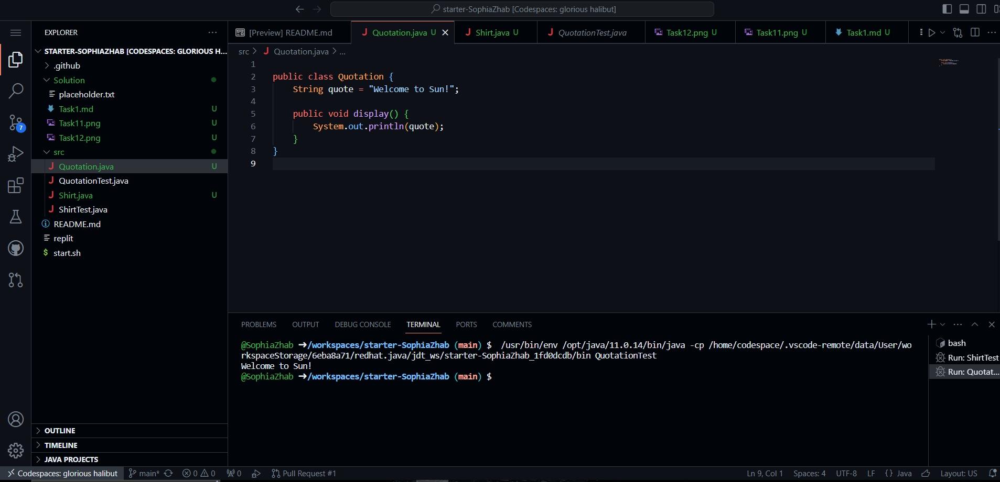
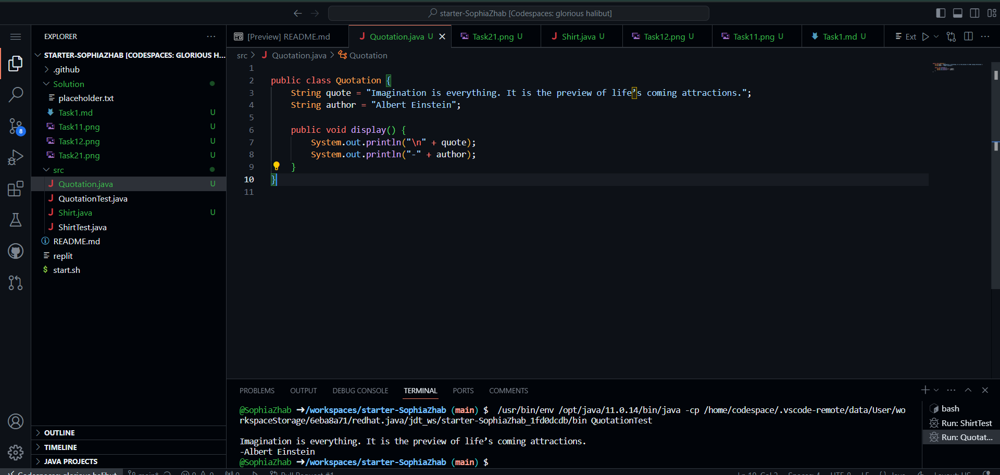

Завдання 2. Створення та запуск іншої програми (цитати)
Запуск початкового коду

Зміна цитати та додавання автора цитати

```java
public class Quotation {
    String quote = "Imagination is everything. It is the preview of life’s coming attractions.";
    String author = "Albert Einstein";

    public void display() {
        System.out.println("\n" + quote);
        System.out.println("-" + author);
    }
}
```